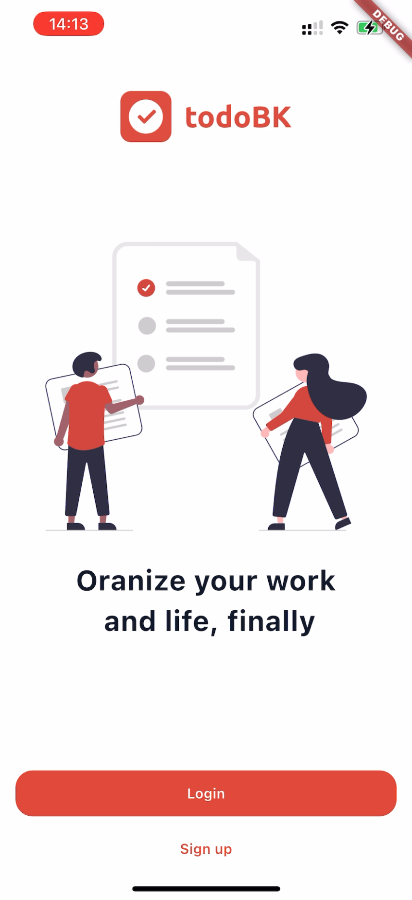
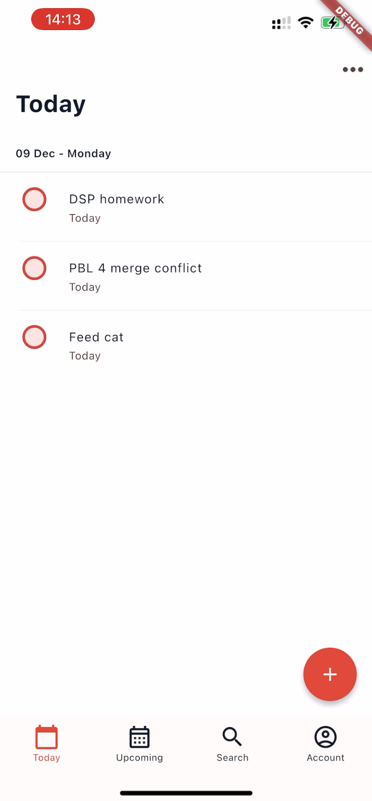
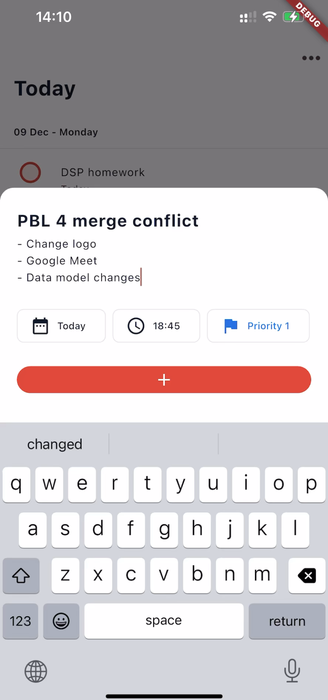
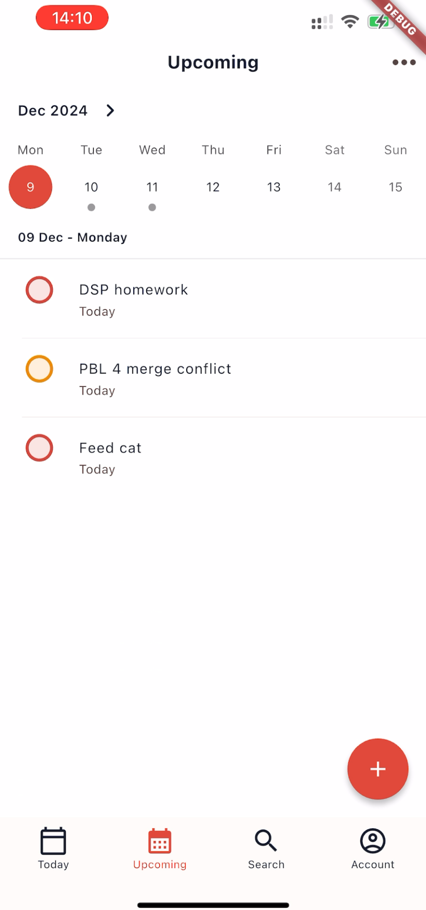
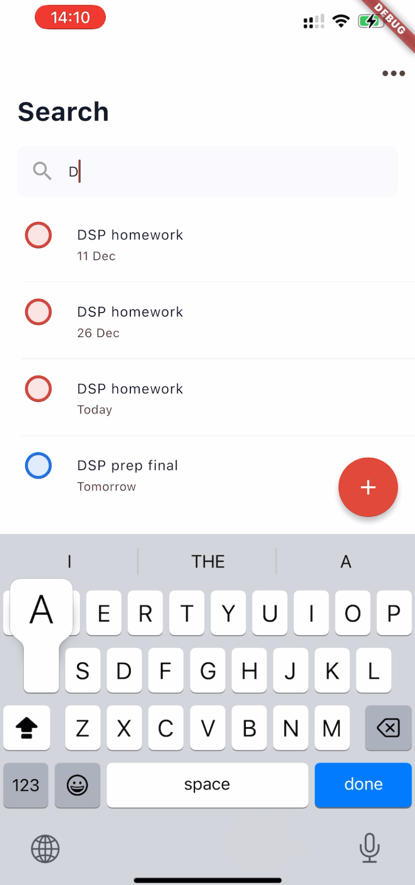
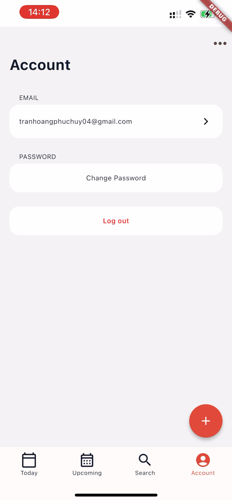

## Personal task management platform

Tiếng Việt tại [đây](README_VI.md) 

The platform helps users:

- Creating task with ease
- Keep track of task completion
- (Admin) Managing users' tasks

> **Note:**
> Based on [Todolist app](https://todoist.com/)
>
> A product of **_Project-based learning - Semester 4 (PBL 4): Networking-and-OS based project_** (Danang University of Science and Technology)

## Preview

    <table>
        <tr>
            <td align="center">
                  <i> Onboarding screen
            </td>
            <td align="center">
                 <i>Task list
            </td>
            <td align="center">
                 <i>Create new task
            </td>
        </tr>
        <tr>
            <td align="center">
                 <i>Calendar view
            </td>
            <td align="center">
                 <i>Task searching
            </td>
            <td align="center">
                 <i>Account management
            </td>
        </tr>
    </table>

## Architecture & Installation

Built on client-server model, the platform consists of corresponding components and frameworks:

- Mobile: Flutter
- Web: HTML, CSS, JS
- Backend: .NET Core, Entity Framework Core, SQL Server

> **Note:**
> Installation guide for each component of the platform:
>
> - [Backend](backend/README.md)
> - [Frontend](web/README.md)
> - [Mobile](mobile/taskmanager/README.md)

## References

- Original app: [Todoist](https://todoist.com/downloads)
- App's architecture: Adapted from [flutter_bloc_template](https://github.com/beobeodev/flutter_bloc_template)
- Calendar widget: forked from [table_calendar 3.1.2](https://pub.dev/packages/table_calendar)
- Illustration images: [unDraw](https://undraw.co/illustrations)